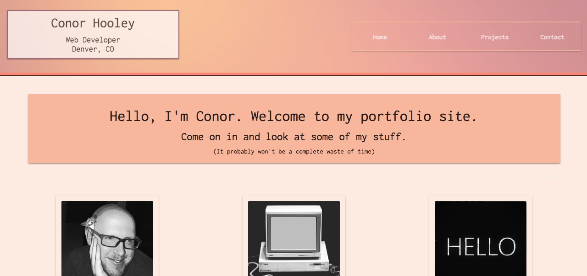

# Conor Hooley's Portfolio Site

This site is meant to showcase my work and serve as a networking asset for connecting with the development community.

## Installation

This project was generated with [Angular CLI](https://github.com/angular/angular-cli) version 6.0.8. To get the Angular CLI, run `npm install -g @angular/cli`

Run `npm install` to install dependencies.

## Serving

Run `ng serve` for a dev client server. Navigate to `http://localhost:4200/`. The app will automatically reload if you change any of the source files.

## Tech Used
- Angular 6
- TypeScript
- Express
- Knex
- PostgreSQL
- Node.js
- Materialize
- Heroku
- Firebase

## Contact info
cchooley@gmail.com
https://www.linkedin.com/in/conor-hooley/